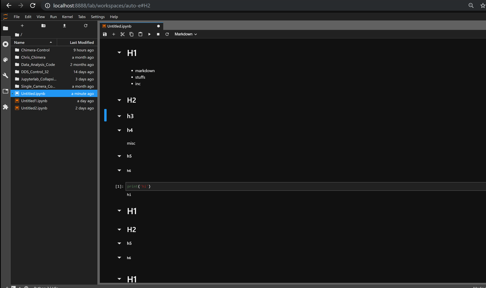

# Collapsible_Headings

Make headings collapsible like the old Jupyter notebook extension and like Mathematica notebooks.

This is an early version of this idea. A selected header cell (i.e. markdown cell starting with some number of "#") can be collapsed / uncollapsed by clicking on the caret icon created to the left of header cells, by using the **ctrl Q** hotkey (currently hard-coded), or by explicitly calling the collapse command in the commands utility on the left area of jupyterlab.



## Prerequisites
* JupyterLab

## Installation

```bash
jupyter labextension install @aquirdturtle/collapsible_headings
```

## Development

For a development install (requires npm version 4 or later), do the following in the repository directory:

```bash
npm install
npm run build
jupyter labextension link .
```

To rebuild the package and the JupyterLab app:

```bash
npm run build
jupyter lab build
```
