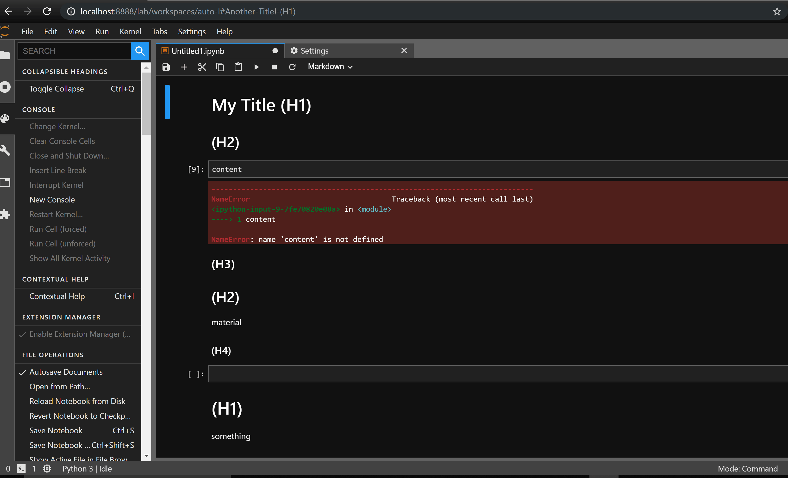

# Collapsible_Headings

Make headings collapsible like the old Jupyter notebook extension and like Mathematica notebooks.

This is an early version of this idea. Core collapsing functionality has been implemented, but the UI for this functionality still leaves a lot to be desired. A selected header cell (i.e. markdown cell starting with some number of "#") can be collapsed / uncollapsed by using the **ctrl Q** hotkey (currently hard-coded) or by explicitly calling the collapse command in the commands utility on the left area of jupyterlab. I have yet to figure out how to add a widget to the cell to have some clickable ui-element for collapsing as opposed to the shortcut, and similarly in order to visually indicate that there is collapsed content, the extension appends "(...)" to the markdown cell when it collapses it and removes that text (if it is there) when uncollapsing. 




## Prerequisites
* JupyterLab

## Installation

```bash
jupyter labextension install @aquirdturtle/Collapsible_Headings
```

## Development

For a development install (requires npm version 4 or later), do the following in the repository directory:

```bash
npm install
npm run build
jupyter labextension link .
```

To rebuild the package and the JupyterLab app:

```bash
npm run build
jupyter lab build
```

